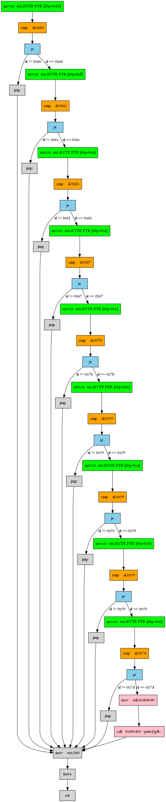

# problem3_kakutake の解

私の使用した環境は以下のとおりです。

```
% uname -a
Linux iserlohn 3.10.0-1062.9.1.el7.x86_64 #1 SMP Fri Dec 6 15:49:49 UTC 2019 x86_64 x86_64 x86_64 GNU/Linux

% cat /etc/redhat-release
CentOS Linux release 7.7.1908 (Core)
```

まずは file コマンドにかけてみます。

```
% file ./problem3_kakutake
./problem3_kakutake: ELF 64-bit LSB executable, x86-64, version 1 (SYSV), dynamically linked (uses shared libs), for GNU/Linux 2.6.32, BuildID[sha1]=5086463c9ffc61b1a4dc8804b9a47baa288ffb04, not stripped
```

ELF 形式なので実行ファイルだとわかりました。ついでに ldd コマンドで依存するライブラリも確認しておきます。

```
% ldd ./problem3_kakutake
        linux-vdso.so.1 =>  (0x00007ffe037f6000)
        libc.so.6 => /lib64/libc.so.6 (0x00007f5020ccf000)
        /lib64/ld-linux-x86-64.so.2 (0x00007f502109d000)
```

とりあえず実行してみます。

```
% ./problem3_kakutake
%
```

何も起きません。

strings コマンドで flag 関係の文字列を探ってみます。

```
% strings ./problem3_kakutake | grep flag
That's flag
```

正解のときの文字列は入ってるようです。

次に gdb コマンドで中身を見てみます。

```
% gdb ./problem3_kakutake
…省略…
(gdb) set disassembly-flavor intel
(gdb) disass main
Dump of assembler code for function main:
   0x000000000040052d <+0>:     push   rbp
   0x000000000040052e <+1>:     mov    rbp,rsp
   0x0000000000400531 <+4>:     sub    rsp,0x10
   0x0000000000400535 <+8>:     mov    QWORD PTR [rbp-0x10],0x0
   0x000000000040053d <+16>:    mov    QWORD PTR [rbp-0x8],0x0
   0x0000000000400545 <+24>:    movzx  eax,BYTE PTR [rbp-0x10]
   0x0000000000400549 <+28>:    cmp    al,0x66
   0x000000000040054b <+30>:    je     0x40054f <main+34>
   0x000000000040054d <+32>:    jmp    0x4005a9 <main+124>
   0x000000000040054f <+34>:    movzx  eax,BYTE PTR [rbp-0xf]
   0x0000000000400553 <+38>:    cmp    al,0x6c
   0x0000000000400555 <+40>:    je     0x400559 <main+44>
   0x0000000000400557 <+42>:    jmp    0x4005a9 <main+124>
   0x0000000000400559 <+44>:    movzx  eax,BYTE PTR [rbp-0xe]
   0x000000000040055d <+48>:    cmp    al,0x61
   0x000000000040055f <+50>:    je     0x400563 <main+54>
   0x0000000000400561 <+52>:    jmp    0x4005a9 <main+124>
   0x0000000000400563 <+54>:    movzx  eax,BYTE PTR [rbp-0xd]
   0x0000000000400567 <+58>:    cmp    al,0x67
   0x0000000000400569 <+60>:    je     0x40056d <main+64>
   0x000000000040056b <+62>:    jmp    0x4005a9 <main+124>
   0x000000000040056d <+64>:    movzx  eax,BYTE PTR [rbp-0xc]
   0x0000000000400571 <+68>:    cmp    al,0x7b
   0x0000000000400573 <+70>:    je     0x400577 <main+74>
   0x0000000000400575 <+72>:    jmp    0x4005a9 <main+124>
   0x0000000000400577 <+74>:    movzx  eax,BYTE PTR [rbp-0xb]
   0x000000000040057b <+78>:    cmp    al,0x59
   0x000000000040057d <+80>:    je     0x400581 <main+84>
   0x000000000040057f <+82>:    jmp    0x4005a9 <main+124>
   0x0000000000400581 <+84>:    movzx  eax,BYTE PTR [rbp-0xa]
   0x0000000000400585 <+88>:    cmp    al,0x59
   0x0000000000400587 <+90>:    je     0x40058b <main+94>
   0x0000000000400589 <+92>:    jmp    0x4005a9 <main+124>
   0x000000000040058b <+94>:    movzx  eax,BYTE PTR [rbp-0x9]
   0x000000000040058f <+98>:    cmp    al,0x59
   0x0000000000400591 <+100>:   je     0x400595 <main+104>
   0x0000000000400593 <+102>:   jmp    0x4005a9 <main+124>
   0x0000000000400595 <+104>:   movzx  eax,BYTE PTR [rbp-0x8]
   0x0000000000400599 <+108>:   cmp    al,0x7d
   0x000000000040059b <+110>:   je     0x40059f <main+114>
   0x000000000040059d <+112>:   jmp    0x4005a9 <main+124>
   0x000000000040059f <+114>:   mov    edi,0x400640
   0x00000000004005a4 <+119>:   call   0x400410 <puts@plt>
   0x00000000004005a9 <+124>:   mov    eax,0x0
   0x00000000004005ae <+129>:   leave
   0x00000000004005af <+130>:   ret
(gdb)
```

最後の方の 0x40059f 行でレジスタ edi に 0x400640 を入れてから
0x4005a4 行で puts 関数を call しています。
つまり、edi には puts 関数の引数となる文字列のアドレスが入っているのでは
と推測されます。
0x400640 の領域を確認します。

```
(gdb) x/s 0x400640
0x400640:       "That's flag"
(gdb)
```

予想通り "That's flag" の文字列が入っていました。

つまり、適切なフラグが用意されると、必ず  0x40059f を通るはずだと考えられます。

処理の流れを確認しました。



これより、movzx → cmp → je の命令の繰り返しが行われるようによいことがわかりました。
したがって、cmp 命令の第一オペランド al と第二オペランドの16進数が同じ値になるようにしてあげればいいと考えられます。

それぞれの cmp 命令の第二オペランドの 16進数を並べると次のようになります。

```
0x66,0x6c,0x61,0x67,0x7b,0x59,0x59,0x59,0x7d
```

アスキーコードで文字に変換すると、

```
flag{YYY}
```

ということになります。これがフラグです。

あとはこれをコードに組み込めば完了です。

次に組み込み方を考えます。
nl 連打していってもいいのですが、もう少しオートマチックに行きたい。

movz のところを抜き出して書いてみます。

```
   0x0000000000400545 <+24>:    movzx  eax,BYTE PTR [rbp-0x10]
   0x000000000040054f <+34>:    movzx  eax,BYTE PTR [rbp-0xf]
   0x0000000000400559 <+44>:    movzx  eax,BYTE PTR [rbp-0xe]
   0x0000000000400563 <+54>:    movzx  eax,BYTE PTR [rbp-0xd]
   0x000000000040056d <+64>:    movzx  eax,BYTE PTR [rbp-0xc]
   0x0000000000400577 <+74>:    movzx  eax,BYTE PTR [rbp-0xb]
   0x0000000000400581 <+84>:    movzx  eax,BYTE PTR [rbp-0xa]
   0x000000000040058b <+94>:    movzx  eax,BYTE PTR [rbp-0x9]
   0x0000000000400595 <+104>:   movzx  eax,BYTE PTR [rbp-0x8]
```

レジスタ eax に入れる値が、レジスタ rbp-0x10 から 1 バイトずつ増えて最後は rbp-0x8 となっています。
rbp-0x10 から 9 バイト分の連続した領域の値を順に読み出していることがわかります。

というわけで、先程のフラグの値を rbp-0x10 の領域に書き込んでやればいいはずです。

最初の movzx 命令が行われるアドレス 0x400545 にブレークポイントをセットし、そこまで実行します。

```
(gdb) b *0x400545
Breakpoint 1 at 0x400545
(gdb) run
Starting program: /home/foo/./problem3_kakutake

Breakpoint 1, 0x0000000000400545 in main ()
Missing separate debuginfos, use: debuginfo-install glibc-2.17-292.el7.x86_64
```

とりあえず rbp-0x10 の領域から16バイト分をダンプしてみます。

```
(gdb) x/16x $rbp-0x10
0x7fffffffe4a0: 0x00    0x00    0x00    0x00    0x00    0x00    0x00    0x00
0x7fffffffe4a8: 0x00    0x00    0x00    0x00    0x00    0x00    0x00    0x00
```

オール 0 でした。
それでは rbp-0x10 に "flag{YYY}" つまり、0x66,0x6c,0x61,0x67,0x7b,0x59,0x59,0x59,0x7d を書き込んでいきます。
int 指定で 4 バイトずつ書き込みますが、リトルエンディアンなので逆順になります。

```
(gdb) set {int}($rbp-0x10)=0x67616c66
(gdb) set {int}($rbp-0x10+4)=0x5959597b
(gdb) set {int}($rbp-0x10+4+4)=0x0000007d
(gdb) x/16x $rbp-0x10
0x7fffffffe4a0: 0x66    0x6c    0x61    0x67    0x7b    0x59    0x59    0x59
0x7fffffffe4a8: 0x7d    0x00    0x00    0x00    0x00    0x00    0x00    0x00
```

準備は整いました。
それではコンティニューさせてみましょう。

```
(gdb) c
Continuing.
That's flag
[Inferior 1 (process 1355) exited normally]
(gdb)
```

見事 "That's flag" が表示されました。

上記の一連の作業を自動化する gdb コマンドリスト resolv.txt を書いてみます。

```
% vi resolv.txt
b *0x400545
run
set {int}($rbp-0x10)=0x67616c66
set {int}($rbp-0x10+4)=0x5959597b
set {int}($rbp-0x10+4+4)=0x0000007d
c
quit
```

（他の環境では 0x400545 のところは別のアドレスになるかもしれません）

バッチ実行して "That's flag" を表示させます。

```
% gdb -x ./resolv.txt --batch-silent ./problem3-kakutake
That's flag
```

以上
