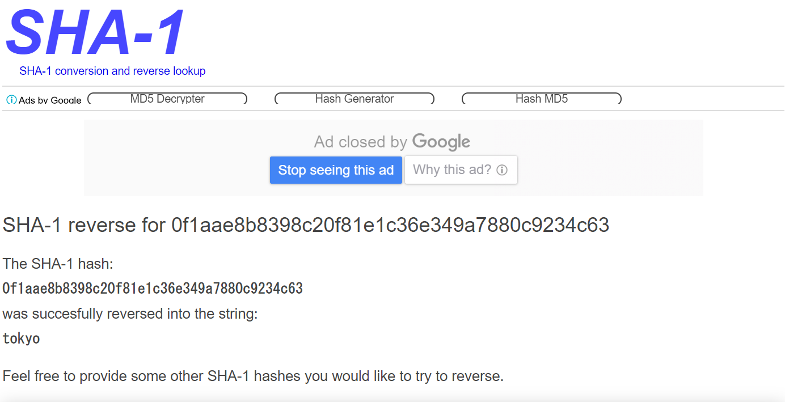

# problem4_kakutake の解

答え：flag{tokyo}

私の使用した環境は以下のとおりです。

```
% uname -a
Linux iserlohn 3.10.0-1062.9.1.el7.x86_64 #1 SMP Fri Dec 6 15:49:49 UTC 2019 x86_64 x86_64 x86_64 GNU/Linux

% cat /etc/redhat-release
CentOS Linux release 7.7.1908 (Core)
```

まずは file コマンドにかけてみます。

```
% file ./problem4_kakutake
./problem4_kakutake: ELF 64-bit LSB executable, x86-64, version 1 (SYSV), dynamically linked (uses shared libs), for GNU/Linux 2.6.32, BuildID[sha1]=5086463c9ffc61b1a4dc8804b9a47baa288ffb04, not stripped
```

ELF 形式なので実行ファイルだとわかりました。ついでに ldd コマンドで依存するライブラリも確認しておきます。

```
% ldd ./problem4_kakutake
        linux-vdso.so.1 =>  (0x00007ffe037f6000)
        libc.so.6 => /lib64/libc.so.6 (0x00007f5020ccf000)
        /lib64/ld-linux-x86-64.so.2 (0x00007f502109d000)
```

とりあえず実行してみます。

```
% ./problem4_kakutake
flag{amritsar}              ← 入力
%
```

標準入力を使っているようなので echo コマンドを使ってフラグをパイプで渡してやっても良いはずです。

```
% echo 'flag{heinessen}' | ./problem4_kakutake
%

% echo 'flag{el_facil}' | ./problem4_kakutake
%

% echo 'flag{fezzan}' | ./problem4_kakutake
%

% echo 'flag{astarte}' | ./problem4_kakutake
%
…
```

色々ためしてみましたがだめでした。
(上で試してるワード群がわかる方とはお友達になれそうな気がします ^_^)

strings コマンドで flag 関係の文字列を探ってみます。

```
% strings ./problem4_kakutake | grep flag
flag{%9s}
That's flag
```

正解時に表示されるメッセージと、ちょっとそれっぽい文字列が見つかりました。

```
% echo 'flag{%9s}' | ./problem4_kakutake
%
```

…違うようです。

次に gdb コマンドで中身を見てみます。

```
% gdb ./problem4_kakutake
…省略…
(gdb) set disassembly-flavor intel
(gdb) disass main
Dump of assembler code for function main:
   0x000000000040074a <+0>:     push   rbp
   0x000000000040074b <+1>:     mov    rbp,rsp
   0x000000000040074e <+4>:     sub    rsp,0x30
   0x0000000000400752 <+8>:     mov    QWORD PTR [rbp-0x30],0x0
   0x000000000040075a <+16>:    mov    QWORD PTR [rbp-0x28],0x0
   0x0000000000400762 <+24>:    lea    rax,[rbp-0x30]
   0x0000000000400766 <+28>:    mov    rsi,rax
   0x0000000000400769 <+31>:    mov    edi,0x400920
   0x000000000040076e <+36>:    mov    eax,0x0
   0x0000000000400773 <+41>:    call   0x4005e0 <__isoc99_scanf@plt>
   0x0000000000400778 <+46>:    mov    BYTE PTR [rbp-0x2b],0x0
   0x000000000040077c <+50>:    lea    rdx,[rbp-0x20]
   0x0000000000400780 <+54>:    lea    rax,[rbp-0x30]
   0x0000000000400784 <+58>:    mov    esi,0x5
   0x0000000000400789 <+63>:    mov    rdi,rax
   0x000000000040078c <+66>:    call   0x4006fd <calc_sha1>
   0x0000000000400791 <+71>:    test   eax,eax
   0x0000000000400793 <+73>:    jne    0x40079a <main+80>
   0x0000000000400795 <+75>:    jmp    0x400884 <main+314>
   0x000000000040079a <+80>:    movzx  eax,BYTE PTR [rbp-0x20]
   0x000000000040079e <+84>:    cmp    al,0xf
   0x00000000004007a0 <+86>:    je     0x4007a7 <main+93>
   0x00000000004007a2 <+88>:    jmp    0x400884 <main+314>
   0x00000000004007a7 <+93>:    movzx  eax,BYTE PTR [rbp-0x1f]
   0x00000000004007ab <+97>:    cmp    al,0x1a
   0x00000000004007ad <+99>:    je     0x4007b4 <main+106>
   0x00000000004007af <+101>:   jmp    0x400884 <main+314>
   0x00000000004007b4 <+106>:   movzx  eax,BYTE PTR [rbp-0x1e]
   0x00000000004007b8 <+110>:   cmp    al,0xae
   0x00000000004007ba <+112>:   je     0x4007c1 <main+119>
   0x00000000004007bc <+114>:   jmp    0x400884 <main+314>
   0x00000000004007c1 <+119>:   movzx  eax,BYTE PTR [rbp-0x1d]
   0x00000000004007c5 <+123>:   cmp    al,0x8b
   0x00000000004007c7 <+125>:   je     0x4007ce <main+132>
   0x00000000004007c9 <+127>:   jmp    0x400884 <main+314>
   0x00000000004007ce <+132>:   movzx  eax,BYTE PTR [rbp-0x1c]
   0x00000000004007d2 <+136>:   cmp    al,0x83
   0x00000000004007d4 <+138>:   je     0x4007db <main+145>
   0x00000000004007d6 <+140>:   jmp    0x400884 <main+314>
   0x00000000004007db <+145>:   movzx  eax,BYTE PTR [rbp-0x1b]
   0x00000000004007df <+149>:   cmp    al,0x98
   0x00000000004007e1 <+151>:   je     0x4007e8 <main+158>
   0x00000000004007e3 <+153>:   jmp    0x400884 <main+314>
   0x00000000004007e8 <+158>:   movzx  eax,BYTE PTR [rbp-0x1a]
   0x00000000004007ec <+162>:   cmp    al,0xc2
   0x00000000004007ee <+164>:   je     0x4007f5 <main+171>
   0x00000000004007f0 <+166>:   jmp    0x400884 <main+314>
   0x00000000004007f5 <+171>:   movzx  eax,BYTE PTR [rbp-0x19]
   0x00000000004007f9 <+175>:   cmp    al,0xf
   0x00000000004007fb <+177>:   je     0x400802 <main+184>
   0x00000000004007fd <+179>:   jmp    0x400884 <main+314>
   0x0000000000400802 <+184>:   movzx  eax,BYTE PTR [rbp-0x18]
   0x0000000000400806 <+188>:   cmp    al,0x81
   0x0000000000400808 <+190>:   je     0x40080c <main+194>
   0x000000000040080a <+192>:   jmp    0x400884 <main+314>
   0x000000000040080c <+194>:   movzx  eax,BYTE PTR [rbp-0x17]
   0x0000000000400810 <+198>:   cmp    al,0xe1
   0x0000000000400812 <+200>:   je     0x400816 <main+204>
   0x0000000000400814 <+202>:   jmp    0x400884 <main+314>
   0x0000000000400816 <+204>:   movzx  eax,BYTE PTR [rbp-0x16]
   0x000000000040081a <+208>:   cmp    al,0xc3
   0x000000000040081c <+210>:   je     0x400820 <main+214>
   0x000000000040081e <+212>:   jmp    0x400884 <main+314>
   0x0000000000400820 <+214>:   movzx  eax,BYTE PTR [rbp-0x15]
   0x0000000000400824 <+218>:   cmp    al,0x6e
   0x0000000000400826 <+220>:   je     0x40082a <main+224>
   0x0000000000400828 <+222>:   jmp    0x400884 <main+314>
   0x000000000040082a <+224>:   movzx  eax,BYTE PTR [rbp-0x14]
   0x000000000040082e <+228>:   cmp    al,0x34
   0x0000000000400830 <+230>:   je     0x400834 <main+234>
   0x0000000000400832 <+232>:   jmp    0x400884 <main+314>
   0x0000000000400834 <+234>:   movzx  eax,BYTE PTR [rbp-0x13]
   0x0000000000400838 <+238>:   cmp    al,0x9a
   0x000000000040083a <+240>:   je     0x40083e <main+244>
   0x000000000040083c <+242>:   jmp    0x400884 <main+314>
   0x000000000040083e <+244>:   movzx  eax,BYTE PTR [rbp-0x12]
   0x0000000000400842 <+248>:   cmp    al,0x78
   0x0000000000400844 <+250>:   je     0x400848 <main+254>
   0x0000000000400846 <+252>:   jmp    0x400884 <main+314>
   0x0000000000400848 <+254>:   movzx  eax,BYTE PTR [rbp-0x11]
   0x000000000040084c <+258>:   cmp    al,0x80
   0x000000000040084e <+260>:   je     0x400852 <main+264>
   0x0000000000400850 <+262>:   jmp    0x400884 <main+314>
   0x0000000000400852 <+264>:   movzx  eax,BYTE PTR [rbp-0x10]
   0x0000000000400856 <+268>:   cmp    al,0xc9
   0x0000000000400858 <+270>:   je     0x40085c <main+274>
   0x000000000040085a <+272>:   jmp    0x400884 <main+314>
   0x000000000040085c <+274>:   movzx  eax,BYTE PTR [rbp-0xf]
   0x0000000000400860 <+278>:   cmp    al,0x23
   0x0000000000400862 <+280>:   je     0x400866 <main+284>
   0x0000000000400864 <+282>:   jmp    0x400884 <main+314>
   0x0000000000400866 <+284>:   movzx  eax,BYTE PTR [rbp-0xe]
   0x000000000040086a <+288>:   cmp    al,0x4c
   0x000000000040086c <+290>:   je     0x400870 <main+294>
   0x000000000040086e <+292>:   jmp    0x400884 <main+314>
   0x0000000000400870 <+294>:   movzx  eax,BYTE PTR [rbp-0xd]
   0x0000000000400874 <+298>:   cmp    al,0x63
   0x0000000000400876 <+300>:   je     0x40087a <main+304>
   0x0000000000400878 <+302>:   jmp    0x400884 <main+314>
   0x000000000040087a <+304>:   mov    edi,0x40092a
   0x000000000040087f <+309>:   call   0x4005b0 <puts@plt>
   0x0000000000400884 <+314>:   mov    eax,0x0
   0x0000000000400889 <+319>:   leave
   0x000000000040088a <+320>:   ret
End of assembler dump.
(gdb)
```

最後の puts 関数の引数にセットされる 0x40092a の領域を確認します。

```
(gdb) x/s 0x40092a
0x40092a:       "That's flag"
(gdb)
```

正解時のメッセージでした。

call される関数より、全体の構造はこんな感じでしょうか。

```
…
0x400773 :             scanf 関数 (入力の受け付け)
…
0x40078c :             calc_sha1 関数 (???)
…
0x40079a 〜 0x400878 : movzx → cmp → je の繰り返し (入力のチェック)
…
0x40087f :             puts 関数 (正解を示す "That's flag" の表示)
…
```

今回も problem3_kakutake と同じような繰り返しのコードが出てきましたので、とりあえず cmp 命令の第二オペランドの 16進数を抜き出してみます。

```
0x0f,0x1a,0xae,0x8b,0x83,0x98,0xc2,0x0f,0x81,0xe1,
0xc3,0x6e,0x34,0x9a,0x78,0x80,0xc9,0x23,0x4c,0x63
```

20 個見つかりました。これらをアスキーコードとして文字にしてみましょう。

```
0x0f → SI (シフトイン)
0x1a → SUB (置換)
0xae → (該当なし)
0x8b → (該当なし)
0x83 → (該当なし)
0x98 → (該当なし)
0xc2 → (該当なし)
0x0f → SI (シフトイン)
0x81 → (該当なし)
0xe1 → (該当なし)
0xc3 → (該当なし)
0x6e → n
0x34 → "
0x9a → (該当なし)
0x78 → x
0x80 → (該当なし)
0xc9 → (該当なし)
0x23 → SYN (同期)
0x4c → L
0x63 → c
```

アスキー制御文字や不明なコードが含まれていました。
どうやらアスキーコードではないようです。

…困りました。


ここで少し視点を変えてみます。

0x40078c で call される calc_sha1 関数を見てみましょう。

```
(gdb) disass calc_sha1
Dump of assembler code for function calc_sha1:
   0x00000000004006fd <+0>:     push   rbp
   0x00000000004006fe <+1>:     mov    rbp,rsp
   0x0000000000400701 <+4>:     add    rsp,0xffffffffffffff80
   0x0000000000400705 <+8>:     mov    QWORD PTR [rbp-0x68],rdi
   0x0000000000400709 <+12>:    mov    DWORD PTR [rbp-0x6c],esi
   0x000000000040070c <+15>:    mov    QWORD PTR [rbp-0x78],rdx
   0x0000000000400710 <+19>:    lea    rax,[rbp-0x60]
   0x0000000000400714 <+23>:    mov    rdi,rax
   0x0000000000400717 <+26>:    call   0x4005d0 <SHA1_Init@plt>
   0x000000000040071c <+31>:    mov    eax,DWORD PTR [rbp-0x6c]
   0x000000000040071f <+34>:    movzx  edx,al
   0x0000000000400722 <+37>:    mov    rcx,QWORD PTR [rbp-0x68]
   0x0000000000400726 <+41>:    lea    rax,[rbp-0x60]
   0x000000000040072a <+45>:    mov    rsi,rcx
   0x000000000040072d <+48>:    mov    rdi,rax
   0x0000000000400730 <+51>:    call   0x4005f0 <SHA1_Update@plt>
   0x0000000000400735 <+56>:    lea    rdx,[rbp-0x60]
   0x0000000000400739 <+60>:    mov    rax,QWORD PTR [rbp-0x78]
   0x000000000040073d <+64>:    mov    rsi,rdx
   0x0000000000400740 <+67>:    mov    rdi,rax
   0x0000000000400743 <+70>:    call   0x400600 <SHA1_Final@plt>
   0x0000000000400748 <+75>:    leave
   0x0000000000400749 <+76>:    ret
End of assembler dump.
(gdb)
```

内容はよくわかりませんが、SHA1_Init, SHA1_Update, SHA1_Final が call されています。

ググってみると、これらは "SHA1" というハッシュに関するもので、
与えられたバイト列の SHA1 ハッシュ値を求める関数だということが判明しました。

ここで次のような仮説をたててみます。

入力のバイト列の SHA1 ハッシュ値を計算し、ハッシュ値をチェックしているのではないか？

全体の構造はこんなこんな感じです。

```
…
0x400773 :             scanf 関数 (入力の受け付け)
…
0x40078c :             calc_sha1 関数 (入力のバイト列の SHA1 ハッシュ値の計算)
…
0x40079a 〜 0x400878 : movzx → cmp → je の繰り返し (ハッシュ値のチェック)
…
0x40087f :             puts 関数 (正解を示す "That's flag" の表示)
…
```

この仮説でいけば、cmp 命令の第二オペランドの16進数の並びは SHA1 ハッシュ値のバイト列ということになります。

```
0x0f,0x1a,0xae,0x8b,0x83,0x98,0xc2,0x0f,0x81,0xe1,
0xc3,0x6e,0x34,0x9a,0x78,0x80,0xc9,0x23,0x4c,0x63
```

一般的にハッシュ関数は逆関数が存在しないため、ハッシュ値から元のバイト列を復元することはできません。

以上！

……………………………………………………

……………………………………………………

……………………………………………………

……………………………………………………

……………………………………………………

……………………………………………………

……………………………………………………

……………………………………………………

……………………………………………………

……………………………………………………

……………………………………………………

……………………………………………………

……………………………………………………

……………………………………………………

……………………………………………………

……………………………………………………

……………………………………………………

……………………………………………………


しかしあわてないで！まだワンチャンありますから！

実は世の中には、よく使われる単語とそのハッシュ値を公開している人々がいるのです。

それに期待してググってみましょう。

検索キーワードは次のように16進数を連結した文字列を使ってみます。

```
0f1aae8b8398c20f81e1c36e349a7880c9234c63
```

すると、ヒットしました。



"tokyo" の SHA1 ハッシュ値だったようです。

さっそく試してみましょう。

```
% echo 'tokyo' | ./problem4_kakutake
% 
```

おっと、フラグのフォーマットを間違えました。

```
% echo 'flag{tokyo}' | ./problem4_kakutake
That's flag
%
```

正解は "flag{tokyo}" でした。

----

《補足》

ググってハッシュ値の元の単語を見つけるという、一見してチートな方法で解決しました。

このように、よく使われる単語をそのままハッシュ計算しただけでは簡単にもとの単語を発見されてしまう恐れがあります。

冗談のような話ですが、こんなにいい加減な実装をしている危ない商用システムを何度かみかけたことがあります。

この問題を回避するテクニックとして「ソルト」を使う方法があります。

まずランダムに選んだバイト列を決めておきます。これをソルトと呼びます。

そして対象となる単語のバイト列にソルトを連結してからハッシュ計算を行うのです。

こうしてソルトを付加して計算されたハッシュ値は、ソルトなしのハッシュ値とは全く異なるものになります。
今回のような既知のハッシュ値からもとの単語を見つけるような攻撃に対抗することができます。

……………………………………………………

思いがけず長文になってしまいました。

ここまで読んで下さった方、いらっしゃいますか？

しょうもない雑文に長々とお付き合い頂き、ありがとうございました。

またどこかでお会いできれば、と思います。

〜銀河の歴史がまた１ページ〜
